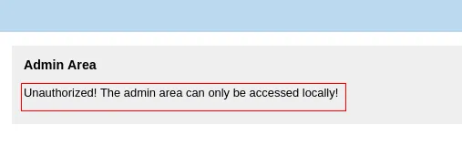

# Host-Header-Bypass

If you encounter an error message like this:

One way to bypass this is by editing the Host header in your request and replacing it with the values below.

## Local Host filters

- Decimal encoding: `2130706433`
- Hex encoding: `0x7f000001`
- Octal encoding: `0177.0000.0000.0001`
- Zero: `0`
- Short form: `127.1`
- IPv6: `::1`
- IPv4 address in IPv6 format: `[0:0:0:0:0:ffff:127.0.0.1]` or `[::ffff:127.0.0.1]`
- localhost